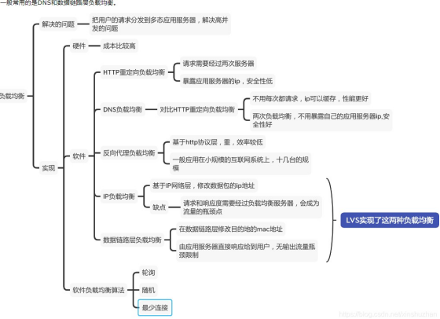

1. LVS与nginx的区别

  **lvs的优势（互联网老辛）：**

    1. 抗负载能力强，因为lvs工作方式的逻辑是非常简单的，而且工作在网络的第4层，仅作请求分 发用，没有流量，所以在效率上基本不需要太过考虑。lvs一般很少出现故障，即使出现故障   一般也是其他地方（如内存、CPU等）出现问题导致lvs出现问题。
    2. 配置性低，这通常是一大劣势同时也是一大优势，因为没有太多的可配置的选项，所以除了增减  服务器，并不需要经常去触碰它，大大减少了人为出错的几率。
    3. 工作稳定，因为其本身抗负载能力很强，所以稳定性高也是顺理成章的事，另外各种lvs都有完整的双机热备方案，所以一点不用担心均衡器本身会出什么问题，节点出现故障的话，lvs会自动判别，所以系统整体是非常稳定的。
    4. 无流量，lvs仅仅分发请求，而流量并不从它本身出去，所以可以利用它这点来做一些线路分流之用。没有流量同时也保住了均衡器的IO性能不会受到大流量的影响。
    5. lvs基本上能支持所有应用，因为lvs工作在第4层，所以它可以对几乎所有应用做负载均衡，包括http、数据库、聊天室等。

  **nginx与LVS的对比：**

    1. nginx工作在网络的第7层，所以它可以针对http应用本身来做分流策略，比如针对域名、目录结构等，相比之下lvs并不具备这样的功能，所以nginx单凭这点可以利用的场合就远多于lvs了；但nginx有用的这些功能使其可调整度要高于lvs，所以经常要去触碰，由lvs的第2条优点来看，触碰多了，人为出现问题的几率也就会大。
    2. nginx对网络的依赖较小，理论上只要ping得通，网页访问正常，nginx就能连得通，nginx同时还能区分内外网，如果是同时拥有内外网的节点，就相当于单机拥有了备份线路；lvs就比较依赖于网络环境，目前来看服务器在同一网段内并且lvs使用direct方式分流，效果较能得到保证。另外注意，lvs需要向托管商至少申请多于一个ip来做visual ip。
    3. nginx安装和配置比较简单，测试起来也很方便，因为它基本能把错误用日志打印出来。lvs的安装和配置、测试就要花比较长的时间，因为同上所述，lvs对网络依赖性比较大，很多时候不能配置成功都是因为网络问题而不是配置问题，出了问题要解决也相应的会麻烦的多。
    4. nginx也同样能承受很高负载且稳定，但负载度和稳定度差lvs还有几个等级：nginx处理所有流量 所以受限于机器IO和配置；本身的bug也还是难以避免的；nginx没有现成的双机热备方案，所以  跑在单机上还是风险比较大，单机上的事情全都很难说。
    5. nginx可以检测到服务器内部的故障，比如根据服务器处理网页返回的状态码、超时等等，并且会把返回错误的请求重新提交到另一个节点。目前lvs中ldirectd也能支持针对服务器内部的情况来监控，但lvs的原理使其不能重发请求。比如用户正在上传一个文件，而处理该上传的节点刚好在上传过程中出现故障，nginx会把上传切到另一台服务器重新处理，而lvs就直接断掉了。

  **两者配合使用：**

    - nginx用来做http的反向代理，能够upsteam实现http请求的多种方式的均衡转发。由于采用的是异步转发可以做到如果一个服务器请求失败，立即切换到其他服务器，直到请求成功或者最后一台服务器失败为止。这可以最大程度的提高系统的请求成功率。
    - lvs采用的是同步请求转发的策略。这里说一下同步转发和异步转发的区别。同步转发是在lvs服务器接收到请求之后，立即redirect到一个后端服务器，由客户端直接和后端服务器建立连接。异步转发是nginx在保持客户端连接的同时，发起一个相同内容的新请求到后端，等后端返回结果后，由nginx返回给客户端。
    - 进一步来说：当做为负载均衡服务器的nginx和lvs处理相同的请求时，所有的请求和响应流量都会经过nginx；但是使用lvs时，仅请求流量经过lvs的网络，响应流量由后端服务器的网络返回。也就是，当作为后端的服务器规模庞大时，nginx的网络带宽就成了一个巨大的瓶颈。
    - 但是仅仅使用lvs作为负载均衡的话，一旦后端接受到请求的服务器出了问题，那么这次请求就失败了。但是如果在lvs的后端在添加一层nginx（多个），每个nginx后端再有几台应用服务器，那么结合两者的优势，既能避免单nginx的流量集中瓶颈，又能避免单lvs时一锤子买卖的问题。

2. nginx实现负载均衡的分发策略

Nginx 的 upstream目前支持的分配算法：

​				1. 轮询 ——1:1轮流处理请求（默认）

  > 每个请求按时间顺序逐一分配到不同的应用服务器，如果应用服务器down掉，自动剔除，剩下的继续轮询。

​				2. 权重 ——you can you up

通过配置权重，指定轮询几率，权重和访问比率成正比，用于应用服务器性能不均的情况。

​				3. ip_哈希算法

每个请求按访问ip的hash结果分配，这样每个访客固定访问一个应用服务器，可以解决session共享的问题。

3. nginx做负载均衡实现的策略有哪些

- 轮询（默认）
- 权重
- ip_hash
- fair(第三方插件）
- url_hash（第三方插件）

4. nginx做负载均衡用到哪些模块

upstream定义负载节点池。
location模块进行URL匹配。
proxy模块发送请求给upstream定义的节点池。

5. 负载均衡有哪些实现方式

- 硬件负载
- HTTP重定向负载均衡
- DNS负载均衡
- 反向代理负载均衡
- IP层负载均衡
- 数据链路层负载均衡

